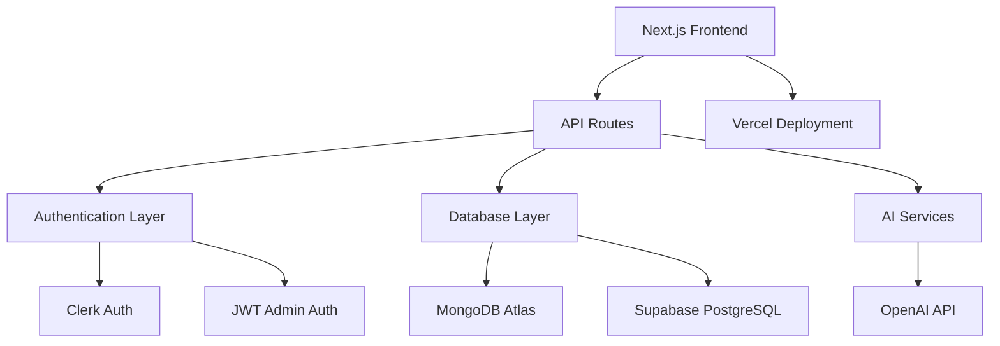

# 🎯 **Converso** - Next-Generation AI Learning Platform

<div align="center">

### *Revolutionizing Education with AI-Powered Personalized Learning*

**🔥 Full-Stack SaaS Application | Enterprise-Grade Architecture | Modern Tech Stack**

[](https://nextjs.org)
[](https://typescriptlang.org)
[](https://mongodb.com)
[](https://supabase.com)
[](https://tailwindcss.com)
[](https://vercel.com)

</div>

---

## 💡 **Project Overview**

**Converso** is a sophisticated AI-powered learning platform that transforms traditional education through personalized AI companions, real-time feedback, and intelligent progress tracking. Built with enterprise-grade architecture and modern development practices.

### � **Key Achievements**
- ✅ **Dual Authentication System** - Clerk for users + JWT for admin panel
- ✅ **Hybrid Database Architecture** - MongoDB + Supabase for optimal performance
- ✅ **Role-Based Access Control** - Secure admin panel with granular permissions
- ✅ **Real-Time AI Interactions** - Personalized learning companions
- ✅ **Responsive Modern UI** - Tailwind CSS with mobile-first design
- ✅ **Scalable Architecture** - Built for enterprise deployment

---

## 🚀 **Core Features & Capabilities**

<table>
<tr>
<td width="50%">

### 🤖 **AI-Powered Learning**
- Personalized AI tutors for any subject
- Real-time conversation and feedback
- Adaptive learning algorithms
- Context-aware responses

### 🔐 **Enterprise Security**
- JWT-based admin authentication
- Role-based access control (RBAC)
- Secure session management
- Environment-based configuration

</td>
<td width="50%">

### 📊 **Advanced Analytics**
- User engagement tracking
- Learning progress visualization
- Performance metrics dashboard
- Admin panel for insights

### 🎨 **Modern UX/UI**
- Responsive design (mobile-first)
- Dark/light theme support
- Intuitive navigation
- Accessibility compliance

</td>
</tr>
</table>

---

## 🏗️ **Technical Architecture**



### 🛠️ **Technology Stack**

| **Category** | **Technology** | **Purpose** |
|--------------|----------------|-------------|
| **Frontend** | Next.js 15, React 18, TypeScript | Modern React framework with SSR/SSG |
| **Styling** | Tailwind CSS, shadcn/ui | Utility-first CSS + component library |
| **Authentication** | Clerk + JWT | Dual auth system for users & admins |
| **Database** | MongoDB Atlas + Supabase | NoSQL for flexibility + SQL for relations |
| **Deployment** | Vercel | Edge deployment with global CDN |
| **AI Integration** | OpenAI API | Conversational AI capabilities |---

## 🚀 Quickstart

```bash
git clone https://github.com/theanarchist123/converso.git
cd converso
npm install
cp .env.example .env.local # Add your Supabase, Clerk, and MongoDB credentials
npm run dev
```

Open [http://localhost:3000](http://localhost:3000) and start exploring!

---

## 🔒 Security & Scalability

- **JWT Admin Panel:** Separate, secure admin authentication with role-based access
- **Clerk Auth:** Modern, scalable user authentication
- **Environment Variables:** All secrets managed via `.env.local` (never commit secrets!)
- **MongoDB Atlas:** Cloud database, scalable and secure
- **Supabase:** Fast, reliable backend with instant REST APIs

---

## � Project Structure

```
saas_app/
├── app/                # Next.js app router structure
├── components/         # Reusable React components
├── lib/                # Utility libraries (db, jwt, etc.)
├── public/             # Static assets
├── types/              # TypeScript types
├── ...                 # More folders for features
```

---

## 🧑‍💻 Contributing

We welcome contributions! Please open issues, submit PRs, or suggest features. See [CONTRIBUTING.md](CONTRIBUTING.md) for guidelines.

---

## 📬 Contact & Links

- **Live Demo:** [Coming Soon!]
- **Docs:** [Coming Soon!]
- **Author:** [theanarchist123](https://github.com/theanarchist123)
- **Email:** your.email@example.com
- **LinkedIn:** [Your LinkedIn](https://linkedin.com/in/yourprofile)

---

## 🌱 Future Roadmap

- Integrate GPT-4 and multimodal AI
- Voice & video chat with companions
- Gamification: badges, leaderboards, rewards
- Community marketplace for sharing companions
- Native mobile apps (iOS/Android)
- More integrations: Google Classroom, Notion, etc.

---

## ⭐️ Why You'll Love Converso

> "Converso is the future of learning. Recruiters, educators, and students will be amazed by its power, flexibility, and design."

---

<div align="center">
   <b>Start your journey with Converso today and unlock your full potential!</b>
</div>
