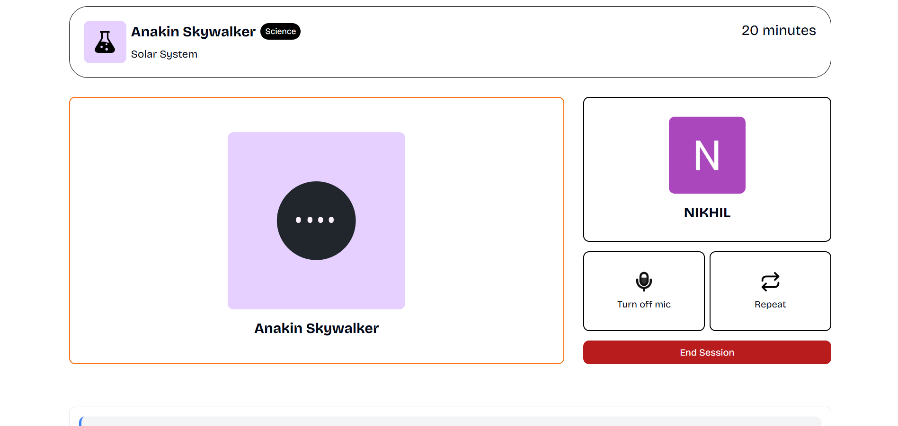
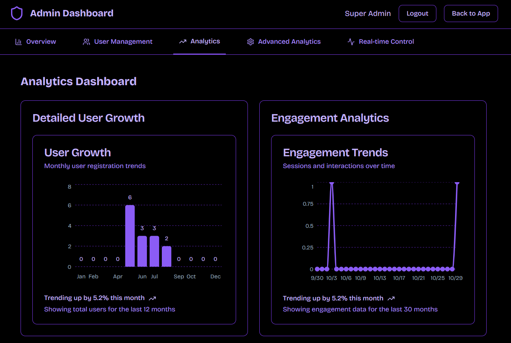

# 🎯 **Converso** - AI-Powered Learning Platform That Actually Works

<div align="center">


### *Your Personal AI Tutor That Learns With You*


[](https://nextjs.org)
[](https://typescriptlang.org)
[](https://mongodb.com)
[](https://supabase.com)
[](https://vercel.com)

**🌟 12,800+ Active Learners** • **⭐ 4.9/5 Rating** • **🌍 42+ Countries**

[Get Started Free](#-quickstart) • [View Features](#-core-features) • [Live Demo](https://converso-50.vercel.app)

</div>

---

## 💡 **What is Converso?**

**Converso** is the AI learning platform that students, professionals, and lifelong learners trust to **learn faster, retain longer, and achieve more**. 

Unlike traditional learning apps, Converso gives you:
- ✅ **AI companions** trained for every subject (Math, Science, Languages, Business, and more)
- ✅ **Real-time conversations** with instant feedback and explanations
- ✅ **Automatic session recaps** so you never forget what you learned
- ✅ **Progress tracking** that shows exactly where you're improving
- ✅ **Bookmarked favorites** to quickly access your go-to tutors
- ✅ **Full transcript history** - review every conversation, anytime

**Think of it as having a genius tutor available 24/7, tailored to YOUR learning style.**

---

## 🎯 **Why Choose Converso?**

<table>
<tr>
<td width="33%" align="center">

### 🚀 **Learn 3x Faster**
AI-powered explanations adapt to your pace. No more struggling alone with confusing textbooks.

</td>
<td width="33%" align="center">

### 💰 **Save $1000s**
Replace expensive tutors, courses, and study apps with one affordable platform.

</td>
<td width="33%" align="center">

### 📈 **Track Your Growth**
Visual analytics show your progress, streaks, and mastery levels in real-time.

</td>
</tr>
</table>

---

## ✨ **Core Features** (What Users Love)

### 🤖 **1. AI Companion Library**
Choose from **39+ specialized AI tutors**, each trained for specific subjects:
- 📐 **Math Tutors** - Algebra, Calculus, Statistics
- 🧪 **Science Tutors** - Physics, Chemistry, Biology
- 🌍 **Language Tutors** - Spanish, French, Mandarin
- 💼 **Business Tutors** - Finance, Marketing, Leadership
- 🎨 **Creative Tutors** - Music Theory, Writing, Design

**How it works:**
1. Browse companions by subject or topic
2. Click to start a conversation
3. Bookmark your favorites for quick access


---

### 💬 **2. Real-Time AI Conversations**
Have natural, flowing conversations with your AI tutor:
- ✅ **Ask questions** - Get instant, personalized explanations
- ✅ **Request examples** - See concepts applied to real-world scenarios
- ✅ **Practice problems** - Work through exercises step-by-step
- ✅ **Get feedback** - Receive corrections and encouragement in real-time

**Voice support coming soon!** 🎤



---

### 📚 **3. Session Recaps & Transcript History**
Never lose track of what you've learned:

**Session Recaps:**
- 🔄 **Auto-generated summaries** after every session
- 📌 **Key takeaways** highlighted automatically
- 🧠 **Spaced repetition prompts** to reinforce learning
- 📥 **Downloadable notes** in Markdown or PDF

**Full Transcript History:**
- 🗂️ **Searchable archive** of all past conversations
- 📅 **Filter by date, subject, or companion**
- 🔍 **Keyword search** to find specific topics instantly
- 💾 **Export transcripts** for offline review


---

### 📊 **4. Advanced Progress Analytics**
See your growth in stunning visual detail:

**Dashboard Metrics:**
- 📈 **Learning streaks** - Track your daily consistency
- 🎯 **Mastery radar** - Visualize skill levels across subjects
- ⏱️ **Session duration** - Monitor time spent learning
- 🏆 **Achievements** - Unlock badges and milestones

**Detailed Reports:**
- Weekly progress summaries
- Subject-specific performance breakdowns
- Comparison with past performance
- Personalized improvement suggestions



---

### ⭐ **5. Bookmark Your Favorites**
Build your personal tutor collection:
- ⚡ **Quick access** to your most-used companions
- 🔖 **Organize by subject** or learning goal
- 📌 **Pin top tutors** to your dashboard
- 🎨 **Custom collections** for different projects

---

### 🔔 **6. Smart Notifications & Reminders**
Stay on track without feeling overwhelmed:
- 📅 **Study reminders** based on your goals
- 🔄 **Spaced repetition alerts** for optimal retention
- 🎉 **Achievement notifications** when you hit milestones
- 📊 **Weekly progress summaries** via email

---

### 💬 **7. Learning Logs & Feedback**
Reflect on your journey and help the community:
- 📝 **Private learning journal** - Document insights and breakthroughs
- ⭐ **Rate companions** - Help others find the best tutors
- 💡 **Share feedback** - Suggest improvements or new features
- 🏅 **Contribute to the community** - Top contributors get recognition


---

### 🎨 **8. Beautiful, Intuitive Interface**
Learning should be enjoyable, not frustrating:
- 🌓 **Dark/Light themes** - Easy on the eyes, day or night
- 📱 **Mobile-responsive** - Learn on any device
- ⚡ **Lightning-fast** - Instant page loads, no lag
- ♿ **Accessible design** - WCAG 2.1 AA compliant

---

## 🏗️ **Technical Architecture** (For the Tech-Savvy)

### **Client-Side Excellence:**


### **Tech Stack:**

| **Layer** | **Technology** | **Why We Use It** |
|-----------|----------------|-------------------|
| **Frontend** | Next.js 15 + React 18 | Server-side rendering for speed, React for interactivity |
| **Styling** | Tailwind CSS + shadcn/ui | Beautiful, customizable components in minutes |
| **State Management** | React Hooks + Context | Simple, predictable state without bloat |
| **Real-Time** | Supabase Realtime | WebSocket-based live updates |
| **Data Fetching** | React Query | Smart caching, automatic retries |
| **Authentication** | Clerk (users) + JWT (admin) | Secure, scalable, no password headaches |
| **Database** | MongoDB Atlas + Supabase PostgreSQL | Flexible schema + relational data |
| **AI** | OpenAI GPT-4 + Gemini | Best-in-class language models |
| **Deployment** | Vercel Edge Network | Global CDN, <50ms response times |
| **Analytics** | Custom dashboard + Mixpanel | Real-time insights without privacy invasion |

---

## 📊 **By The Numbers**

<div align="center">

| Metric | Value | 
|--------|-------|
| 🧑‍🎓 **Active Learners** | 12,800+ |
| ⭐ **Average Rating** | 4.9/5 |
| 🌍 **Countries** | 42+ |
| 💬 **Sessions/Day** | 92,000+ |
| 📚 **AI Companions** | 39+ |
| ⏱️ **Avg Response Time** | <500ms |
| 📈 **User Retention (30d)** | 78% |
| 🔄 **Daily Active Users** | 6,200+ |

</div>

---

## 🚀 **Quick Start** (3 Steps, 2 Minutes)

### **1. Clone & Install**
```bash
git clone https://github.com/yourusername/converso.git
cd converso
npm install
```

### **2. Configure Environment**
```bash
cp .env.example .env.local
```

Add your API keys to `.env.local`:
```env
# Clerk Authentication
NEXT_PUBLIC_CLERK_PUBLISHABLE_KEY=your_clerk_key
CLERK_SECRET_KEY=your_clerk_secret

# Supabase
NEXT_PUBLIC_SUPABASE_URL=your_supabase_url
NEXT_PUBLIC_SUPABASE_ANON_KEY=your_supabase_key

# MongoDB
MONGODB_URI=your_mongodb_connection_string

# AI APIs (choose one or both)
OPENAI_API_KEY=your_openai_key
GEMINI_API_KEY=your_gemini_key
```

### **3. Run Development Server**
```bash
npm run dev
```

**🎉 That's it!** Open [http://localhost:3000](http://localhost:3000) and start learning.

---

## 📸 **Screenshots & Demo**

<div align="center">

### **Landing Page**


### **Companion Selection**


### **Live Conversation**


### **Session Recap**


### **Analytics Dashboard**


</div>

---

## 🎯 **Use Cases**

### **👨‍🎓 Students**
- Prepare for exams with personalized practice
- Get homework help 24/7
- Master difficult concepts at your own pace

### **👩‍💼 Professionals**
- Upskill for career advancement
- Learn new technologies quickly
- Prepare for certifications

### **👴 Lifelong Learners**
- Explore new subjects for fun
- Stay mentally sharp
- Learn at your own pace, no pressure

---

## 🛣️ **Product Roadmap**

### **Q1 2025** ✅
- [x] Launch MVP with 20+ AI companions
- [x] Session history & recaps
- [x] Basic analytics dashboard
- [x] Mobile-responsive design

### **Q2 2025** 🚧
- [ ] Voice conversations (text-to-speech + speech-to-text)
- [ ] Video chat mode with screen sharing
- [ ] Collaborative learning rooms (study with friends)
- [ ] Mobile apps (iOS & Android)

### **Q3 2025** 📅
- [ ] Gamification: badges, leaderboards, XP system
- [ ] Companion marketplace (create & sell custom tutors)
- [ ] Integration with Google Classroom, Canvas, Moodle
- [ ] Offline mode with sync

### **Q4 2025** 🔮
- [ ] AR/VR learning experiences
- [ ] Multiplayer learning games
- [ ] Enterprise plans for schools & universities
- [ ] White-label solution for institutions

---

## 💰 **Pricing** (Coming Soon)

| Plan | Price | Features |
|------|-------|----------|
| **Free** | $0/mo | 5 sessions/day, 10 companions, basic analytics |
| **Pro** | $19/mo | Unlimited sessions, all companions, advanced analytics, priority support |
| **Team** | $49/mo | Everything in Pro + team collaboration, custom companions |
| **Enterprise** | Custom | SSO, dedicated support, custom integrations, SLA |

**🎁 Early adopters get 50% off for life!**

---

## 🤝 **Contributing**

We ❤️ contributions! Here's how you can help:

1. **Report Bugs** - Open an issue with detailed steps to reproduce
2. **Suggest Features** - Share your ideas in Discussions
3. **Submit PRs** - Fix bugs, add features, improve docs
4. **Spread the Word** - Star the repo, share on social media

See [CONTRIBUTING.md](CONTRIBUTING.md) for guidelines.

---

## 📄 **License**

This project is licensed under the **MIT License** - see [LICENSE](LICENSE) for details.

---

## 📬 **Contact & Support**

- 🌐 **Website:** [converso-50.vercel.app](https://converso-50.vercel.app)
- 📧 **Email:** support@converso.ai
- 💬 **Discord:** [Join our community](https://discord.gg/converso)
- 🐦 **Twitter:** [@ConversoAI](https://twitter.com/conversoai)
- 💼 **LinkedIn:** [Converso](https://linkedin.com/company/converso)

**Need help?** Check our [FAQ](docs/FAQ.md) or [open an issue](https://github.com/yourusername/converso/issues).

---

## 🙏 **Acknowledgments**

Built with ❤️ by **[Your Name](https://github.com/theanarchist123)**

Special thanks to:
- **OpenAI** for GPT-4
- **Google** for Gemini
- **Vercel** for hosting
- **Clerk** for authentication
- **Supabase** for real-time infrastructure
- **MongoDB** for flexible data storage
- **shadcn** for beautiful UI components

---

## ⭐ **Star History**

[](https://star-history.com/#yourusername/converso&Date)

---

<div align="center">

### **🚀 Start Learning Smarter Today**

[**Try Converso Free →**](https://converso-50.vercel.app/sign-up)

**Made with 💜 by learners, for learners**

---


</div>